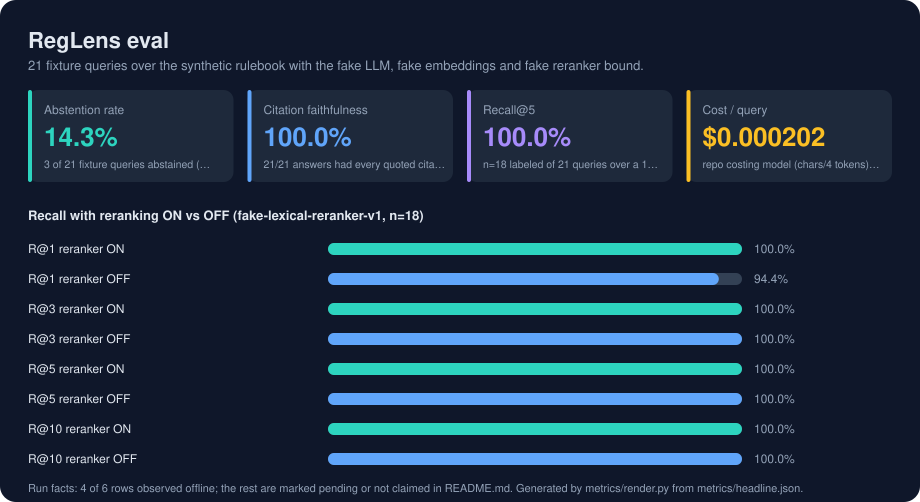

# RegLens

**Regulatory intelligence for compliance teams, with citations that can be checked and an audit trail that can be replayed.**

Ask a question about a rulebook and get an answer grounded in retrieved evidence, with every citation pointing at a real rule, every quote verified against the source text, and a refusal when the evidence is too weak to answer. Every query is written to a hash-chained audit record with an evidence digest, so a reviewer can see exactly what the system read before it answered, months later.

Everything runs offline by default: deterministic embeddings, a deterministic generator and a deterministic reranker are bound in fake mode, so the full test suite, the evaluation harness and the analyst UI work with no API key, no vector database and no model download. OpenAI providers, Qdrant and a cross-encoder reranker are optional layers that switch on by explicit configuration and fail closed when unavailable.

---

## At a glance

| | |
|---|---|
| **The problem** | Compliance teams need answers they can cite. A retrieval system that paraphrases a rule, invents a citation, or answers confidently from thin evidence is worse than no system, because it looks authoritative. |
| **What it does** | Citation-preserving ingestion of regulatory text (Markdown, HTML, PDF, allowlisted FINRA URLs); hybrid retrieval (BM25 plus dense embeddings fused with Reciprocal Rank Fusion); exact-citation routing; optional reranking; grounded generation with prompt-local evidence markers; citation and quote verification; weak-evidence abstention; durable chat sessions with transcript export; hash-chained query audits with JSON and Markdown exports; API-key auth and rate limiting; an offline evaluation harness including adversarial source-instruction cases. |
| **Stack** | Python 3.11+, FastAPI, SQLite, BM25, Reciprocal Rank Fusion, a dependency-free analyst UI; optional Qdrant, OpenAI embeddings and Responses API, `sentence-transformers` cross-encoder, `pypdf`; Docker and Compose; GitHub Actions. |
| **Validation** | Lint, `mypy`, 275 deterministic fake-mode tests, an offline eval harness reporting retrieval, citation, quote, refusal, answer-safety, warning-recall and audit metrics, an audit-chain verification endpoint, and opt-in browser, Qdrant, OpenAI, model-download and container profiles. |

<!-- metrics:start -->

## Results



Every figure below was observed by `make eval`, which runs offline with a fixed seed and no API key, and writes `metrics/headline.json`. 21 fixture queries over the synthetic rulebook with the fake LLM, fake embeddings and fake reranker bound. Rows marked *pending* need hardware, data or a service the offline harness does not have; nothing here is estimated.

| Metric | Value | How it was measured |
|---|---|---|
| Abstention rate | **14.3%** | 3 of 21 fixture queries abstained (3 out-of-scope expected); 0 false abstentions; refusal accuracy 100.0% |
| Citation faithfulness | **100.0%** | 21/21 answers had every quoted citation verified against retrieved evidence; citation precision 100.0% |
| Recall@5 | **100.0%** | n=18 labeled of 21 queries over a 15-chunk synthetic corpus; recall@3 100.0%, recall@10 100.0% |
| Cost / query | **$0.000202** | repo costing model (chars/4 tokens) over observed fake-run text at configured gpt-5.4-nano + text-embedding-3-small rates; mean of 21 queries, ~792 in / 34 out tokens; live-provider run pending |

**Recall with reranking ON vs OFF (fake-lexical-reranker-v1, n=18)**

| | | |
|---|---|---|
| R@1 reranker ON | `████████████████████` | 100.0% |
| R@1 reranker OFF | `███████████████████░` | 94.4% |
| R@3 reranker ON | `████████████████████` | 100.0% |
| R@3 reranker OFF | `████████████████████` | 100.0% |
| R@5 reranker ON | `████████████████████` | 100.0% |
| R@5 reranker OFF | `████████████████████` | 100.0% |
| R@10 reranker ON | `████████████████████` | 100.0% |
| R@10 reranker OFF | `████████████████████` | 100.0% |

**Run facts**

| | Status | Evidence |
|---|---|---|
| Eval fixture | observed | 21 queries, 15 chunks, 2 corpora, fake LLM + fake embeddings, seed 0 |
| Observed fake-run cost | observed | $0.000000 (fake providers) |
| Answer safety / warning recall | observed | 100.0% / 100.0% on 4 adversarial source-instruction cases |
| Audit hash chain | observed | 21 records, 0 failures, verified=True |
| Cross-encoder reranker (ms-marco-MiniLM-L-6-v2) | pending | not measured: needs sentence-transformers and a model weight download; harness is offline |
| Live OpenAI cost per query | pending | not measured: requires OPENAI_API_KEY; harness runs fake providers |

<!-- metrics:end -->

## The answer path

```
question ──► route (conceptual / citation reference / exact citation)
         ──► retrieve: BM25 + dense, fused by RRF, exact citations pinned first
         ──► rerank (optional) ──► trim to evidence budget, with diagnostics
         ──► generate with [E1]…[En] evidence markers
         ──► verify every citation resolves and every quote appears in its evidence
         ──► abstain if evidence is weak, warn if instructions were found in sources
         ──► persist: hash-chained audit row + evidence digest + cost estimate
```

Verification is not optional and not a prompt. A citation that does not resolve or a quote that does not appear in the retrieved snippet is caught in code, after generation, before the answer is returned.

## Quick start

```bash
python -m venv .venv && source .venv/bin/activate
make install
python -m uvicorn app.main:app --reload
```

Open `http://127.0.0.1:8000/` for the analyst UI, or ask directly:

```bash
curl -s -X POST http://127.0.0.1:8000/query \
  -H 'Content-Type: application/json' \
  -d '{"question": "What must a member firm do before executing a customer order?"}' | jq .
```

The response carries the answer, its citations, the evidence each citation resolves to, verification results, retrieval diagnostics (dense, keyword and fusion scores), and the audit id. `GET /audit/queries/{id}/export?format=markdown` renders the whole thing for a reviewer. `GET /audit/verify` walks the hash chain.

Then run the gate:

```bash
make verify        # lint, typecheck, offline tests, eval
```

`make eval` writes `reports/eval-latest.md`. Read it: the safety cases (instruction override, citation suppression, prompt leak, same-sentence clause injection) are the ones that show what the system refuses to do.

## Documentation

| | |
|---|---|
| [`docs/OVERVIEW.md`](docs/OVERVIEW.md) | The problem, the design and its reasons, what is measured |
| [`docs/SHOWCASE.md`](docs/SHOWCASE.md) | A guided tour of every feature, with commands and files |
| [`docs/OPERATIONS.md`](docs/OPERATIONS.md) | Every run mode, endpoint, environment variable, optional provider and verification profile |
| [`docs/CHANGELOG.md`](docs/CHANGELOG.md) | The build log, wave by wave |
| [`docs/reglens-project-brief.md`](docs/reglens-project-brief.md) | The original brief |
| [`docs/agent-orchestration-notes.md`](docs/agent-orchestration-notes.md), [`docs/implementation-log.md`](docs/implementation-log.md) | How the work was planned and executed |

## What it is not

Not legal advice, not a substitute for counsel, not connected to any live regulatory feed by default. The bundled rulebook is synthetic. FINRA URL ingestion is allowlisted and snapshots source bytes locally so that what was ingested can be shown, but a snapshot is a snapshot.
